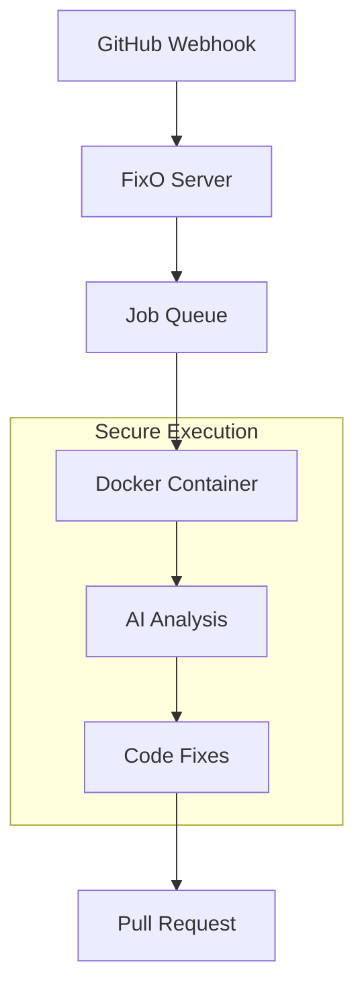

# FixO Dev

<div align="center">


**🤖 AI-Powered Code Fixes, Delivered as Pull Requests**

_Transform your development workflow with instant, intelligent code improvements_

[](LICENSE.md)
[](https://github.com/epavanello/fixodev/stargazers)
[](https://github.com/epavanello/fixodev/issues)
[](https://github.com/epavanello/fixodev/pulls)
[](https://discord.gg/jjKSatbfYM)

[📖 **Documentation**](docs/) • [💬 **Community**](https://discord.gg/jjKSatbfYM) • [🐛 **Report Bug**](https://github.com/epavanello/fixodev/issues)

</div>

---

## 🌟 About the Project

**FixO Dev Bot** is revolutionizing how developers handle code quality and maintenance. Instead of spending hours on repetitive fixes, linting, and formatting, simply mention `@fixodev` in any GitHub issue or PR, and watch as our AI-powered bot delivers professional-grade improvements directly as pull requests.

### 🎯 Our Mission

> **To eliminate the friction between identifying code issues and implementing solutions, making high-quality code accessible to every developer and project.**

We believe that:

- 🔧 **Code quality shouldn't be a luxury** - Every project deserves clean, maintainable code
- ⚡ **Automation beats manual work** - Developers should focus on creativity, not repetitive tasks
- 🤝 **AI should augment, not replace** - Intelligent assistance that learns from your codebase
- 🌍 **Open source drives innovation** - Community-driven development creates better tools

---

## ✨ Why FixO Dev Bot?

<table>
<tr>
<td width="50%">

### 🚀 **Instant Impact**

- **Zero setup required** - Works with any GitHub repository
- **Mention and done** - Just type `@fixodev` in issues or PRs
- **Professional results** - AI-powered fixes that follow best practices
- **Multiple languages** - TypeScript, JavaScript, Python, and more

</td>
<td width="50%">

### 🛡️ **Secure & Reliable**

- **Containerized execution** - Isolated, secure code processing
- **No data retention** - Your code stays private
- **Open source** - Full transparency in how your code is handled
- **Enterprise ready** - Built for teams and organizations

</td>
</tr>
</table>

### 🎬 **See It In Action**

<div align="center">   
   
https://github.com/user-attachments/assets/bda78cae-e068-49cc-8a0a-562d35f14b25

</div>

_Watch FixO Dev Bot in action - from mention to pull request in minutes!_

```bash
# 1. Mention @fixodev in any GitHub issue or PR comment
# 2. Watch the magic happen!

# Example: In a GitHub issue
"Hey @fixodev, can you refactor the code to use the new API?"

# Result: Professional PR with fixes in minutes ✨
```

---

## 🚀 Quick Start

### For Repository Owners

1. **[Install the GitHub App](https://github.com/apps/fixo-dev)** on your repository _(required only for private repos)_
2. **Configure** (optional) by adding `.fixodev.yml` to your repo root
3. **Trigger** the bot by mentioning `@fixodev` in:
   - 💬 Issue comments
   - 🔄 Pull request comments
   - 📝 New issues

### For Contributors & Testers

We're actively seeking contributors and testers! Here's how you can help:

- 🧪 **Beta Testers**: Try the bot on your projects and report feedback
- 🛠️ **Developers**: Contribute to the core platform or integrations
- 📚 **Documentation**: Help improve our guides and examples
- 🎨 **Designers**: Enhance our UI/UX and visual identity
- 🌐 **Community**: Share your experience and help others

[**Join our Discord**](https://discord.gg/jjKSatbfYM) to get started!

---

## 🏗️ Architecture & Technology

<div align="center">



</div>

### 🔧 **Tech Stack**

- **Runtime**: Bun + TypeScript for blazing-fast performance
- **Framework**: Hono for lightweight, efficient HTTP handling
- **Containerization**: Docker for secure, isolated code execution
- **AI Integration**: OpenRouter models with custom prompt engineering
- **Database**: SQLite with Drizzle ORM for simplicity
- **Frontend**: SvelteKit with TailwindCSS for modern UI

### 🏛️ **Core Components**

- **🎣 GitHub App Server**: Webhook handling and authentication
- **⚡ Queue System**: Reliable job processing with retry mechanisms
- **🐳 Docker Orchestration**: Secure, isolated script execution
- **🧠 LLM Integration**: Intelligent code analysis and improvements
- **🔄 Git Operations**: Automated branch management and PR creation

---

## 🎯 Roadmap & Changelog

### 🚀 **Current Status** (v0.1.0)

- ✅ Core GitHub App functionality
- ✅ Basic AI-powered code fixes
- ✅ Docker containerization
- ✅ Automated PR creation

### 🚀 **Current Status** (v0.2.0)

- ✅ **Full thread context** - Complete issue conversation awareness for better AI understanding
- ✅ **Iterative PR improvements** - Add comments to request changes and refinements
- ✅ **AI reasoning transparency** - Show agent's thought process and considerations in PR discussions for debugging
- ✅ **Usage tracking** - Display job costs and remaining free tier interactions

### 🔮 **Coming Soon** (v0.3.0)

- 📝 **Line-specific feedback** - Comment on specific code lines for targeted improvements
- 🎯 **Code-level tagging** - Tag the bot on specific lines to generate targeted PRs
- 💎 **Subscription system** - Premium access for private repos and advanced AI models

### 🌟 **Future Vision** (v1.0+)

- TBD

---

## 🤝 Contributing

We believe the best tools are built by the community, for the community. Whether you're a seasoned developer or just starting out, there's a place for you in the FixO Dev Bot project!

### 🌟 **Ways to Contribute**

<table>
<tr>
<td width="33%">

#### 🧪 **Testing & Feedback**

- Try the bot on your projects
- Report bugs and edge cases
- Suggest new features
- Share your experience

</td>
<td width="33%">

#### 💻 **Development**

- Fix bugs and implement features
- Improve performance and reliability
- Add support for new languages
- Enhance AI capabilities

</td>
<td width="33%">

#### 📚 **Documentation**

- Write tutorials and guides
- Improve API documentation
- Create video content
- Translate to other languages

</td>
</tr>
</table>

### 🚀 **Getting Started**

```bash
# Clone the repository
git clone https://github.com/epavanello/fixodev.git
cd fixodev

# Install dependencies
bun install

# Set up environment variables
cp env.example .env
# Edit .env with your configuration

# Start development server
bun run dev:server

# Start web app (in another terminal)
bun run dev:web
```

### 📋 **Development Setup**

1. **Prerequisites**: Bun, Docker, GitHub App credentials
2. **Environment**: Copy `env.example` to `.env` and configure
3. **Database**: Run `bun run db:migrate` to set up the database
4. **Testing**: Use `bun test` to run the test suite

[**Read our Contributing Guide**](CONTRIBUTING.md) for detailed instructions.

---

## 💰 Business Model & Sustainability

### 🆓 **Free Tier**

- ✅ Free use on **public repositories** with usage limits
- ✅ Basic AI-powered fixes
- ✅ Community support
- ✅ Standard processing queue

### 💎 **Pro Tier** (Coming 2025)

- 🔒 **Private repository** support
- ⚡ **Priority processing** queue
- 📊 **Advanced analytics** and insights
- 👥 **Team management** features
- 🎯 **Custom fix patterns**
- 📞 **Priority support**

---

## 📊 Project Stats

<div align="center">


</div>

---

## 🏆 Recognition & Community

<div align="center">

<!-- ### 🌟 **Featured On**

[](https://producthunt.com/fixodev)
[](https://news.ycombinator.com/fixodev) -->

### 👥 **Community**

[](https://discord.gg/jjKSatbfYM)
[](https://twitter.com/emadev01)

</div>

---

## 🙏 Sponsors & Supporters

### 💎 **Platinum Sponsors**

_Become our first platinum sponsor and get your logo here!_

### 🥇 **Gold Sponsors**

_Support the future of automated code quality_

### 🥈 **Silver Sponsors**

_Help us build the tools developers deserve_

[**Become a Sponsor**](https://github.com/sponsors/epavanello) and help us build the future of automated code quality!

---

## 📄 License

This project is licensed under the **Business Source License 1.1 (BSL-1.1)**.

- ✅ **Free for non-commercial use** - Perfect for open source projects, learning, and personal use
- ✅ **Source available** - Full transparency and community contributions welcome
- ✅ **Converts to AGPL v3** - Becomes fully open source on January 1, 2035
- 💼 **Commercial licensing available** - Contact us for enterprise use

[Read the full license](LICENSE.md) • [Contact for commercial licensing](mailto:license@fixo.dev)

---

## 🚀 Get Started Today

<div align="center">

### Ready to transform your development workflow?

[](https://github.com/apps/fixo-dev)
[](https://discord.gg/jjKSatbfYM)
[](https://github.com/epavanello/fixodev)

**[📖 Read the Docs](docs/)** • **[🎬 Watch Demo](https://fixo.dev/demo)** • **[💬 Get Support](https://discord.gg/jjKSatbfYM)**

</div>

---

<div align="center">

**Built with ❤️ by @epavanello and the community**

_Making high-quality code accessible to everyone, one pull request at a time._

</div>
